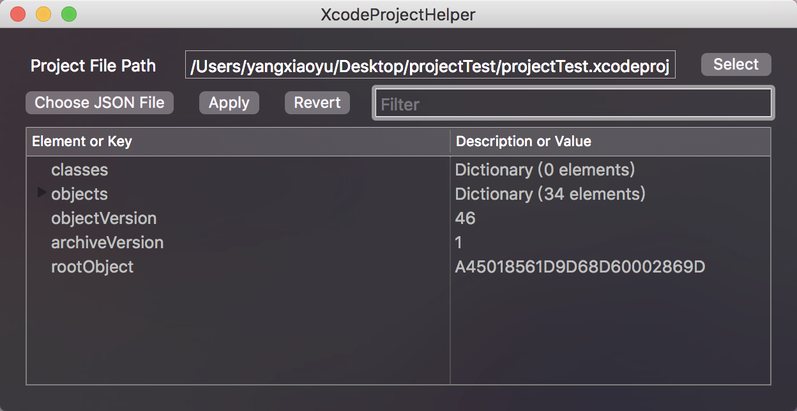
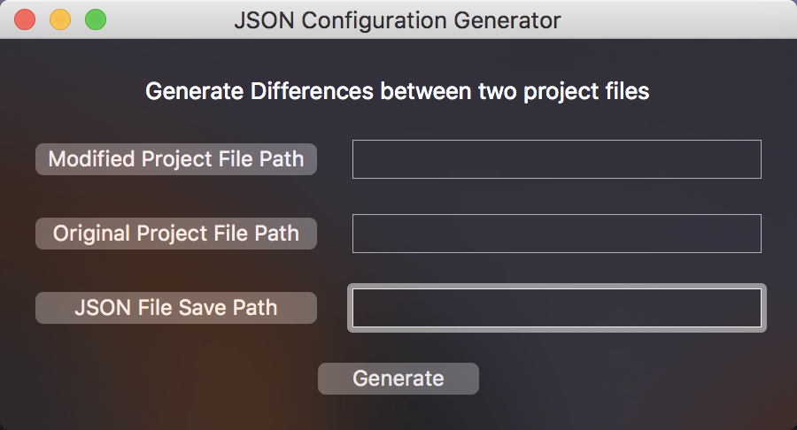

# pbxprojHelper 

pbxprojHelper 可以让你通过原生 UI 应用来创建和修改 Xcode 工程，使用 Cocoa 和 Swift 4 开发。你也可以把 `pbxproj` 当做命令行工具来在终端中使用。



[](https://swift.org)
[](https://travis-ci.org/yulingtianxia/pbxprojHelper)

## 语言

[English](../README.md)

## 文章

[pbxprojHelper--Xcode工程文件助手](http://yulingtianxia.com/blog/2016/11/28/pbxprojHelper/)

[Let's Talk About project.pbxproj](http://yulingtianxia.com/blog/2016/09/28/Let-s-Talk-About-project-pbxproj/)

## 安装 pbxprojHelper

### GitHub

你可以 clone [源码](https://github.com/yulingtianxia/pbxprojHelper/) 然后用 Xcode 编译运行。也可以在最新的 [Releases](https://github.com/yulingtianxia/pbxprojHelper/releases) 版本下载 pbxprojHelper.app 和 pbxproj 工具。

### App Store

Mac App Store 链接: (只包含 pbxprojHelper.app)

https://itunes.apple.com/cn/app/pbxprojhelper/id1160801848

### [Swift package manager](https://swift.org/package-manager)

在你的 `Package.swift` 文件的 `dependencies` 数组中添加 `.Package(url: "https://github.com/yulingtianxia/pbxprojHelper.git", majorVersion: 1)`。

## 快速入门

### 使用 pbxprojHelper (原生 Cocoa UI 应用)

1. 点击 "Select" 按钮选择工程文件，支持 `.xcodeproj` 和 `.pbxproj` 格式。文件路径会显示在旁边的文本框中。大纲视图展示了工程文件的内容。
2. 点击 "Choose JSON File" 按钮选择配置文件。配置文件包含了你想对工程文件做出的修改。你可以自己创建 JSON 格式的配置文件，或者使用 pbxprojHelper 提供的 "JSON Configuration Generator" 工具来生成配置文件。在选择 JSON 文件之后，大纲视图会刷新数据。
3. 点击 "Apply" 按钮可以将 JSON 文件中的配置信息应用（覆写）到工程文件中。
4. "Revert" 按钮是 "Apply" 的逆操作。

### 使用 pbxproj (命令行工具)

最好将 pbxproj 移到 `/usr/local/bin/` 目录, 这样你就能方便地在终端中执行 `pbxproj` 命令了。

使用说明:

```
Usage: pbxproj [command_option] file
Command options are (-convert is the default):
-compare modified_file -o path          compare modified property list file with property list file and generate a json result at the given path
-apply json_file                        apply a json file on property list file
-revert                                 revert property list file to latest backup
-convert                                rewrite property list files in xml format
```

## 大纲视图

大纲视图展示了 project.pbxproj 文件的所有数据。如果数据项是字典或者数组这种集合类型，可以将其展开。举个栗子，最开始的示意图中 `objects` 是一个包含 34 个键值对的字典，可以将其展开查看内容。对于字典的键值对，第一列是 Key，第二列是 Value。如果 Value 是个集合（例如非字符串或数字），第二列显示集合的描述信息；对于数组中的元素，第一列是 Element，第二列什么都没有。

**你可以通过点击大纲视图中的文字来复制文字内容，或者双击复制从根节点开始整个路径的内容**

## 过滤器

在 "Filter" 文本框中输入内容并回车即可对大纲视图中的内容进行过滤，非大小写敏感。

## 工程文件路径

当你点击工程文件路径的时候会出现下拉菜单，它包含了你最近使用过的 5个工程文件。这样你就能快速选择常用工程了。

## JSON 配置文件

### 配置规则

配置文件包含规则清单，举个栗子：

```
{
  "insert" : {
    "objects.A45A665D1D98286400DBED04.children" : [
      "a",
      "b",
      "c"
    ],
    "classes" : {
      "xixihaha": 5,
      "aaaaa" : "养小鱼"
    }
  },
  "remove" : {
    "objects.A45A666D1D98286400DBED04.buildSettings" : [
      "ALWAYS_SEARCH_USER_PATHS"
    ]
  },
  "modify" : {
    "archiveVersion" : "2"
  }
}
```

配置规则含有三个键值对，分别对应增删改三种操作。可以通过 project.pbxproj 中的 keypath 来做 "insert", "remove" 和 "modify" 操作。

最新版本的配置文件会包含两套配置规则 "forward" 和 "backward"，分别对应 "Apply" 和 "Revert" 两种操作。

#### Insert

上面的例子向 `children` 数组中插入了 `"a"`,`"b"`,`"c"` 三个元素。注意路径 `"objects.A45A665D1D98286400DBED04.children"` 必须是有效的，`"children"` 必须是个数组，而 `"classes"` 必须是字典类型。**总之新增的数据类型必须跟 project.pbxproj  文件中原有数据类型相同。**

#### Remove

上面的例子从 `buildSettings` 字典中删除了一个键为 `"ALWAYS_SEARCH_USER_PATHS"` 的键值对。**要删除对应 keypath 的数据时，配置规则对应的值必须是个数组**，这个数组包含了字典中要被删除键值对的键或者是数组中要被删除的元素内容。

#### Modify

直接改 keypath 对应的值，就这么简单！

### 配置文件生成器

程序员都是懒惰的，我不能容忍把时间浪费在写 JSON 文件上，所以我创造了这个功能强大的工具，他就是 "JSON Configuration Generator"：



**有两种方法可以打开 "Generator" 窗口:**

1. 菜单栏 -> Window -> JSON Configuration Generator
2. 快捷键: ⇧⌘0

你可以简单粗暴地使用它。只需选择两个工程文件并指定 JSON 文件存储路径，然后点击 "Generate" 按钮即可得到一个 JSON 文件。这个 JSON 文件含有 "Modified Project" 相对于 "Original Project" 的改动内容。

反之，当你想将这些改动内容再次应用到某个工程文件上时，你会用到这个 JSON 文件。请务必保管好它。

## Backups

每当你点击主窗口的 "Apply" 按钮时，pbxprojHelper 都会先创建工程文件备份，然后再将变更应用到工程文件中。备份的后缀名为 "backup"，存储于应用的 "Documents" 文件夹。

~~"Revert" 按钮会将工程文件回滚为上次的备份。~~

## Encoding

当生成 XML 格式的工程文件时，中文字符将会被转成 Unicode 数学符号。比如 OpenStep 风格文件中的 `"杨萧玉"` 在 XML 文件中将会被转成 `<string>&#26472;&#33831;&#29577;</string>`。这是因为 Xcode 在把 XML 工程文件转为 OpenStep 工程文件时，会将 XML 文件当做 ASCII 编码处理，并转码为 Unicode。

## LICENSE

These works are available under the GNU General Public License. See the [LICENSE](../LICENSE) file for more info.

